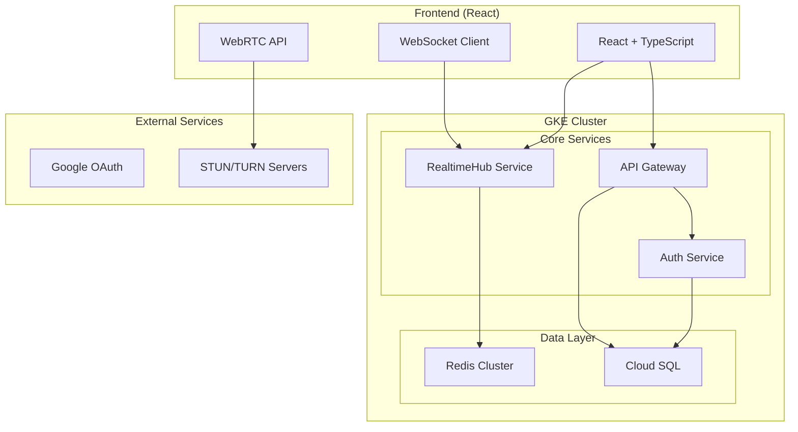

# cline-meet
clineと一緒に作る、Google Meetクローン

# Google Meet クローン 最終アーキテクチャ設計

## システム概要



## 技術スタック

### フロントエンド
- **React 18** + **TypeScript**: UI開発
- **Vite**: 高速ビルド
- **WebRTC API**: ブラウザ間直接通信
- **WebSocket**: シグナリング・チャット
- **Tailwind CSS**: スタイリング
- **Zustand**: 状態管理

### バックエンド (Go)
- **Go 1.24**: 高性能・並行処理
- **Gin**: Webフレームワーク
- **Gorilla WebSocket**: WebSocket実装
- **GORM**: ORM
- **go-redis**: Redis クライアント

### インフラ (GCP + Kubernetes)
- **GKE**: Kubernetesクラスター
- **Cloud SQL (PostgreSQL)**: データベース
- **Redis Memorystore**: セッション・リアルタイムデータ
- **Container Registry**: Dockerイメージ保存
- **Cloud Build**: CI/CDパイプライン

## Kubernetesによる最適化

### 不要になるクラウドリソース
1. **Cloud Run** → **GKE Pods**: より細かい制御が可能
2. **Cloud Load Balancing** → **Ingress Controller**: K8s内で負荷分散
3. **Cloud CDN** → **Istio + Envoy**: Service Mesh内でキャッシュ

### 新たに活用するK8sリソース
1. **ConfigMap/Secret**: 設定管理
2. **PersistentVolume**: ログ・一時ファイル保存
3. **NetworkPolicy**: セキュリティ強化
4. **ServiceMonitor**: Prometheus監視

## 核心となるRealtimeHub設計

### 統合されたRealtimeHub
```go
type RealtimeHub struct {
    // WebSocket接続管理
    clients    map[*Client]bool
    register   chan *Client
    unregister chan *Client
    
    // ルーム管理
    rooms      map[string]*Room
    
    // メッセージ処理
    messageHandler chan Message
    
    // Redis連携
    redis      *redis.Client
    
    // 並行処理制御
    mutex      sync.RWMutex
}

type Client struct {
    hub      *RealtimeHub
    conn     *websocket.Conn
    send     chan []byte
    userID   string
    roomID   string
    isHost   bool
    isMuted  bool
}

type Message struct {
    Type         string      `json:"type"`
    SenderUserID string      `json:"senderUserId,omitempty"`
    TargetUserID string      `json:"targetUserId,omitempty"`
    RoomID       string      `json:"roomId"`
    Payload      interface{} `json:"payload"`
    Timestamp    time.Time   `json:"timestamp"`
}
```

### メッセージタイプ定義
```go
const (
    // WebRTCシグナリング
    MSG_WEBRTC_OFFER     = "webrtc_offer"
    MSG_WEBRTC_ANSWER    = "webrtc_answer"
    MSG_ICE_CANDIDATE    = "ice_candidate"
    
    // ルーム管理
    MSG_JOIN_ROOM        = "join_room"
    MSG_LEAVE_ROOM       = "leave_room"
    MSG_USER_JOINED      = "user_joined"
    MSG_USER_LEFT        = "user_left"
    
    // チャット
    MSG_CHAT_MESSAGE     = "chat_message"
    
    // 制御
    MSG_MUTE_USER        = "mute_user"
    MSG_ADMIT_USER       = "admit_user"
    MSG_SCREEN_SHARE     = "screen_share"
)
```

## データベース設計

```sql
-- ユーザーテーブル
CREATE TABLE users (
    id UUID PRIMARY KEY DEFAULT gen_random_uuid(),
    google_id VARCHAR UNIQUE,
    email VARCHAR,
    name VARCHAR,
    avatar_url VARCHAR,
    created_at TIMESTAMP DEFAULT NOW()
);

-- ルームテーブル
CREATE TABLE rooms (
    id UUID PRIMARY KEY DEFAULT gen_random_uuid(),
    name VARCHAR,
    host_id UUID REFERENCES users(id),
    is_waiting_room BOOLEAN DEFAULT true,
    created_at TIMESTAMP DEFAULT NOW(),
    expires_at TIMESTAMP DEFAULT NOW() + INTERVAL '24 hours'
);

-- 参加者テーブル
CREATE TABLE participants (
    room_id UUID REFERENCES rooms(id),
    user_id UUID REFERENCES users(id),
    is_host BOOLEAN DEFAULT false,
    is_muted BOOLEAN DEFAULT false,
    joined_at TIMESTAMP DEFAULT NOW(),
    PRIMARY KEY (room_id, user_id)
);

-- インデックス
CREATE INDEX idx_rooms_host_id ON rooms(host_id);
CREATE INDEX idx_rooms_expires_at ON rooms(expires_at);
CREATE INDEX idx_participants_room_id ON participants(room_id);
```

## Redis データ構造

```go
// アクティブセッション
"session:{userID}" → {
    "roomId": "room123",
    "connectionId": "conn456",
    "serverInstance": "signaling-pod-1",
    "isHost": true,
    "isMuted": false,
    "lastSeen": "2024-01-01T10:00:00Z"
}

// ルーム参加者リスト
"room:{roomID}:participants" → Set["user1", "user2", "user3"]

// チャット履歴（最新100件）
"room:{roomID}:chat" → List[
    {"userId": "user1", "message": "Hello", "timestamp": "..."},
    {"userId": "user2", "message": "Hi", "timestamp": "..."}
]

// 待機室ユーザー
"room:{roomID}:waiting" → Set["user4", "user5"]
```

## スケーリング戦略

### 100万同時接続への対応

#### 1. 水平スケーリング
```yaml
# RealtimeHub Pod設定
apiVersion: apps/v1
kind: Deployment
metadata:
  name: realtime-hub
spec:
  replicas: 100  # 1Pod = 1万接続想定
  template:
    spec:
      containers:
      - name: realtime-hub
        image: gcr.io/project/realtime-hub:latest
        resources:
          requests:
            memory: "512Mi"
            cpu: "500m"
          limits:
            memory: "1Gi"
            cpu: "1000m"
        env:
        - name: MAX_CONNECTIONS
          value: "10000"
```

#### 2. Redis Pub/Sub による Pod間通信
```go
func (h *RealtimeHub) setupRedisSubscription() {
    pubsub := h.redis.Subscribe(context.Background(), "realtime_events")
    
    go func() {
        for msg := range pubsub.Channel() {
            var event Message
            json.Unmarshal([]byte(msg.Payload), &event)
            
            // 他のPodからのメッセージを処理
            h.handleCrossServerMessage(event)
        }
    }()
}

func (h *RealtimeHub) publishToRedis(message Message) {
    data, _ := json.Marshal(message)
    h.redis.Publish(context.Background(), "realtime_events", data)
}
```

#### 3. 負荷分散戦略
```go
// ルームIDベースのConsistent Hashing
func (h *RealtimeHub) getServerForRoom(roomID string) string {
    hash := crc32.ChecksumIEEE([]byte(roomID))
    serverIndex := hash % uint32(len(h.serverList))
    return h.serverList[serverIndex]
}
```

## Kubernetes構成

### 1. Service定義
```yaml
apiVersion: v1
kind: Service
metadata:
  name: realtime-hub-service
spec:
  selector:
    app: realtime-hub
  ports:
  - name: websocket
    port: 8080
    targetPort: 8080
  - name: http
    port: 8081
    targetPort: 8081
  type: ClusterIP
```

### 2. HPA設定
```yaml
apiVersion: autoscaling/v2
kind: HorizontalPodAutoscaler
metadata:
  name: realtime-hub-hpa
spec:
  scaleTargetRef:
    apiVersion: apps/v1
    kind: Deployment
    name: realtime-hub
  minReplicas: 10
  maxReplicas: 200
  metrics:
  - type: Resource
    resource:
      name: cpu
      target:
        type: Utilization
        averageUtilization: 70
  - type: Pods
    pods:
      metric:
        name: websocket_connections
      target:
        type: AverageValue
        averageValue: "8000"
```

## 開発フェーズ (2日間)

### Day 1: 基盤構築
**午前 (4時間)**:
- Go プロジェクト初期化
- RealtimeHub基本実装
- WebSocket接続処理
- 基本的なメッセージルーティング

**午後 (4時間)**:
- データベース設計・実装
- Google OAuth認証
- ルーム作成・参加機能
- Redis連携

### Day 2: 機能完成・デプロイ
**午前 (4時間)**:
- WebRTCシグナリング実装
- リアルタイムチャット
- 画面共有・強制ミュート機能
- フロントエンド統合

**午後 (4時間)**:
- Kubernetes マニフェスト作成
- GKE デプロイ
- 負荷テスト
- 監視設定

## CI/CD パイプライン

```yaml
# cloudbuild.yaml
steps:
# Go バックエンドビルド
- name: 'gcr.io/cloud-builders/go'
  args: ['build', '-o', 'realtime-hub', './cmd/realtime-hub']
  env: ['CGO_ENABLED=0', 'GOOS=linux']

# React フロントエンドビルド
- name: 'gcr.io/cloud-builders/npm'
  args: ['run', 'build']
  dir: 'frontend'

# Docker イメージビルド
- name: 'gcr.io/cloud-builders/docker'
  args: ['build', '-t', 'gcr.io/$PROJECT_ID/realtime-hub:$COMMIT_SHA', '.']

# GKE デプロイ
- name: 'gcr.io/cloud-builders/gke-deploy'
  args:
  - run
  - --filename=k8s/
  - --cluster=meet-cluster
  - --location=asia-northeast1
```

この設計により、技術的に正確で実装可能な100万同時接続対応のGoogle Meetクローンが実現できます。
